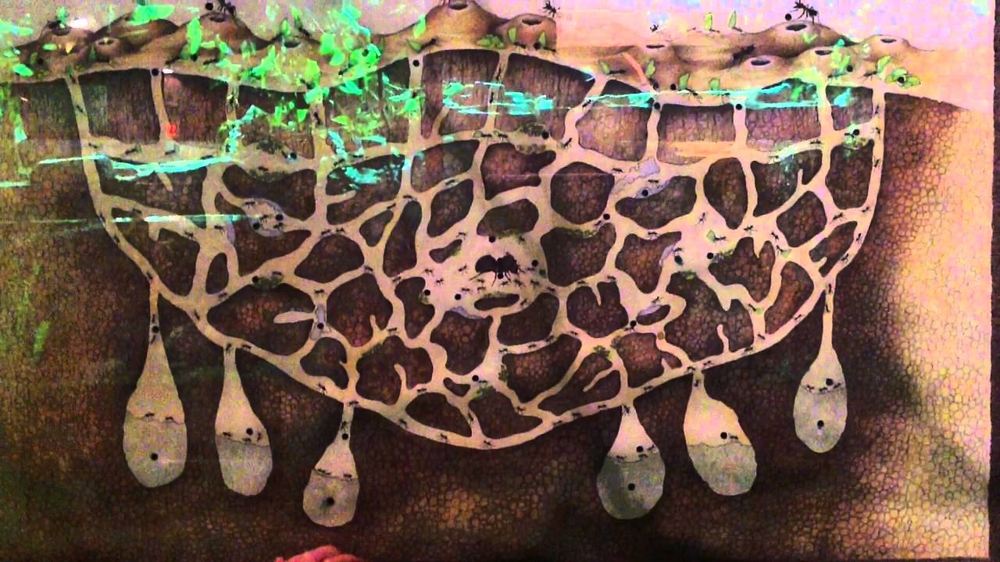
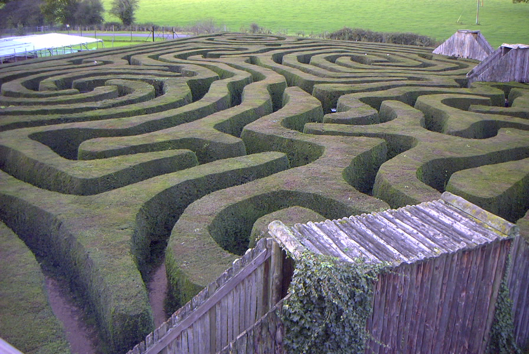
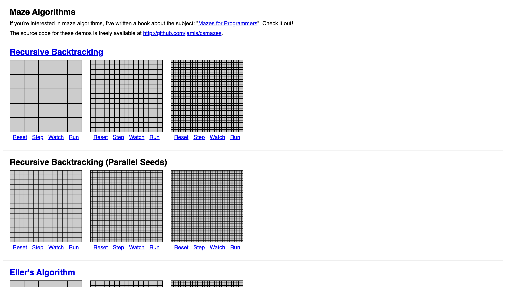
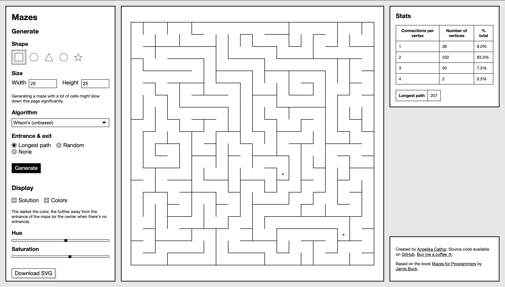
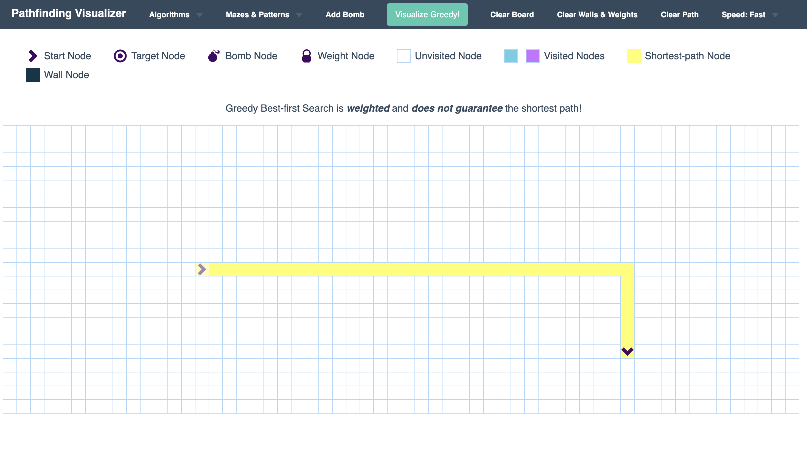

# Презентация защиты курсового проекта

Тема: «Автоматизированная система генерирования структуры лабиринта и нахождения
выхода из него». Собрана по `report/presentation-template.md` (каркас 7 эталонов)
и пояснительной записке. Картинки — рисунки из ПЗ (`presentation-assets/`) и
диаграммы из `diagrams/`. Всего 27 слайдов.

---

### Слайд 1 — Титульный

```
Автоматизированная система генерирования структуры лабиринта
и нахождения выхода из него

Выполнили:
обучающиеся группы 6303-020302D
А.О. Сидоров
Е.А. Фокин

Курсовой проект
по дисциплине «Программная инженерия»

Руководитель:
доцент кафедры ПС
Л.С. Зеленко

Самара 2026
```

---

### Слайд 2 — «Цель и задачи»

```
Цель и задачи

Цель
Разработать систему генерации структуры лабиринта и нахождения выхода из него,
позволяющую создавать лабиринт по заданным параметрам, визуализировать его в
выбранной теме оформления, сохранять и загружать из базы данных, а также
выполнять ручное и автоматическое прохождение. Система реализуется как веб-приложение.

Задачи
Произвести анализ предметной области:
— изучить основные принципы генерирования лабиринтов;
— изучить алгоритмы прохождения лабиринтов;
— выполнить обзор существующих систем-аналогов.

Спроектировать систему:
— разработать информационно-логический проект системы по методологии UML.

Реализовать систему:
— разработать и реализовать программное и информационное обеспечение, провести
  его тестирование и отладку.
```

---

### Слайд 3 — Разделитель «Анализ предметной области»

```
Анализ предметной области
```

---

### Слайд 4 — «Описание предметной области» (основные понятия)

```
Описание предметной области

Лабиринт — структурированное пространство в виде совокупности взаимосвязанных
ячеек, разделённых стенами и проходами, предназначенное для поиска пути от входа
к выходу при соблюдении заданных правил перемещения.

Двумерный лабиринт — лабиринт в виде прямоугольной сетки клеток в декартовой
системе координат, где каждая клетка имеет фиксированные соседние позиции
(вверх, вниз, влево, вправо).

Толстостенный лабиринт — разновидность лабиринта, в котором толщина стены равна
ширине прохода; представляется матрицей нечётной размерности, где стены и проходы
чередуются.
```

---

### Слайд 5 — «Описание предметной области» (классификация)

```
Классификация лабиринтов

По происхождению — естественные / искусственные (архитектурные, графические,
   игровые, компьютерные).
По размерности — двумерные / трёхмерные / многомерные.
По типу тесселяции — квадратной / треугольной / произвольной сетки.
По структуре путей — идеальные / неидеальные.
По структуре стен — тонкостенные / толстостенные.
По способу прохождения — статические / алгоритмические / интерактивные.
```




---

### Слайд 6 — «Описание систем-аналогов»: Maze Algorithms

```
Описание систем-аналогов

Maze Algorithms

Достоинства:
— возможность выбора множества алгоритмов генерации лабиринтов;
— визуальная демонстрация результата генерации.

Недостатки:
— отсутствует система пользователей и авторизация;
— отсутствует хранение лабиринтов;
— нет интеграции алгоритмов поиска пути.
```



---

### Слайд 7 — «Описание систем-аналогов»: Mazes

```
Описание систем-аналогов

Mazes

Достоинства:
— возможность выбора размеров лабиринта;
— возможность выбора алгоритма генерации;
— возможность выбора точек входа и выхода.

Недостатки:
— отсутствуют алгоритмы поиска пути;
— отсутствует ролевая модель;
— нет хранения данных в базе.
```



---

### Слайд 8 — «Описание систем-аналогов»: Pathfinding Visualizer

```
Описание систем-аналогов

Pathfinding Visualizer

Достоинства:
— сильная визуализация процесса поиска пути (посещённые клетки и итоговый путь);
— ориентированность на интерактивность и наглядность алгоритмов.

Недостатки:
— отсутствует генерация классического лабиринта заданного типа;
— отсутствует понятие «толстостенный лабиринт»;
— нет ролей пользователей.
```



---

### Слайд 9 — «Сравнительные характеристики систем-аналогов»

```
| Показатель                                | Maze Algorithms | Mazes | Pathfinding Visualizer | Разрабатываемая система |
|-------------------------------------------|:---------------:|:-----:|:----------------------:|:-----------------------:|
| Несколько алгоритмов генерации            |        +        |   +   |           -            |            +            |
| Настройка размеров                        |        -        |   +   |           -            |            +            |
| Визуализация процесса поиска пути         |        -        |   +   |           +            |            +            |
| Пошаговый режим                           |        -        |   -   |           +            |            +            |
| Ручное прохождение персонажем со следами  |        -        |   -   |           -            |            +            |
| Несколько тем оформления                  |        -        |   -   |           -            |            +            |
| Авторизация пользователей                 |        -        |   -   |           -            |            +            |
| Сохранение/загрузка лабиринтов            |        -        |   -   |           -            |            +            |
```

---

### Слайд 10 — «Диаграмма объектов предметной области»

```
Диаграмма объектов предметной области
```


---

### Слайд 11 — Разделитель «Проектирование системы»

```
Проектирование системы
```

---

### Слайд 12 — «Структурная схема системы»

```
Структурная схема системы
```


---

### Слайд 13 — «Диаграмма вариантов использования»

```
Диаграмма вариантов использования
```


---

### Слайд 14 — «Диаграмма состояний системы»

```
Диаграмма состояний системы
```


---

### Слайд 15 — «Диаграмма состояний администратора»

```
Диаграмма состояний администратора
```


---

### Слайд 16 — «Диаграмма состояний игрока»

```
Диаграмма состояний игрока
```


---

### Слайд 17 — «Логическая модель данных»

```
Логическая модель данных
```


---

### Слайд 18 — «Алгоритм генерации лабиринта методом Прима»

```
Алгоритм генерации лабиринта методом Прима

Строит остовное дерево проходов по двумерной сетке нечётных размеров (7–25):
«комнаты» связываются единственным деревом проходов, а оставшиеся стены
образуют толстостенную структуру. Случайный выбор фронтиров обеспечивает
равномерное ветвление проходов.
```


---

### Слайд 19 — «Волновой алгоритм поиска пути»

```
Волновой алгоритм поиска пути

Находит кратчайший путь от входа до выхода. Основан на поиске в ширину: сетка
рассматривается как невзвешенный граф проходимых клеток, а обход в порядке
очереди гарантирует достижение выхода за минимальное число переходов.
```


---

### Слайд 20 — «Выбор и обоснование комплекса программных средств»

```
Выбор и обоснование комплекса программных средств

Язык программирования — TypeScript

Серверная часть:
— Node.js 22 (среда выполнения);
— NestJS 11 (REST API);
— PostgreSQL 16 + Prisma ORM.

Клиентская часть:
— React 19 + Vite.

Инструменты: Visual Studio Code, Git/GitHub, Docker Compose, StarUML.
```

Картинки: логотипы технологий (по желанию).

---

### Слайд 21 — Разделитель «Реализация системы»

```
Реализация системы
```

---

### Слайд 22 — «Диаграмма развёртывания»

```
Диаграмма развёртывания
```


---

### Слайд 23 — «Диаграмма классов»

```
Диаграмма классов
```


---

### Слайд 24 — «Физическая модель данных»

```
Физическая модель данных
```


---

### Слайд 25 — «Демонстрация работы системы»

```
Демонстрация работы системы
```

Видеозапись работы приложения.

---

### Слайд 26 — «Итоги работы»

```
Итоги работы

— произведён анализ предметной области, рассмотрены системы-аналоги,
  построена диаграмма объектов предметной области;
— спроектирована система: структурная схема, UML-проект, логическая модель
  данных и алгоритмы обработки данных;
— реализована система в соответствии со спецификацией требований, проверена
  её работоспособность.

Применение
Самостоятельное web-приложение для генерации и прохождения лабиринтов и учебная
платформа для изучения алгоритмов на графах (Прима, Краскала, поиск в ширину,
метод правой руки).
```

---

### Слайд 27 — «Спасибо за внимание»

```
Спасибо за внимание
```
