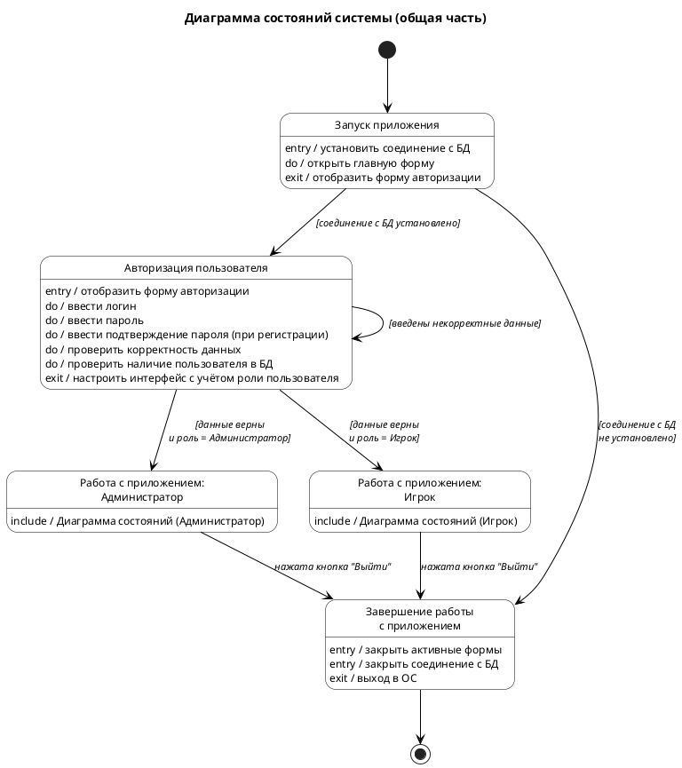
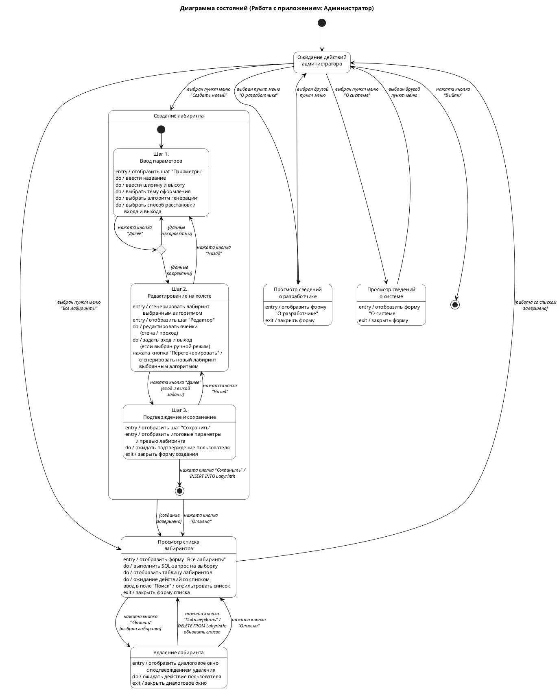
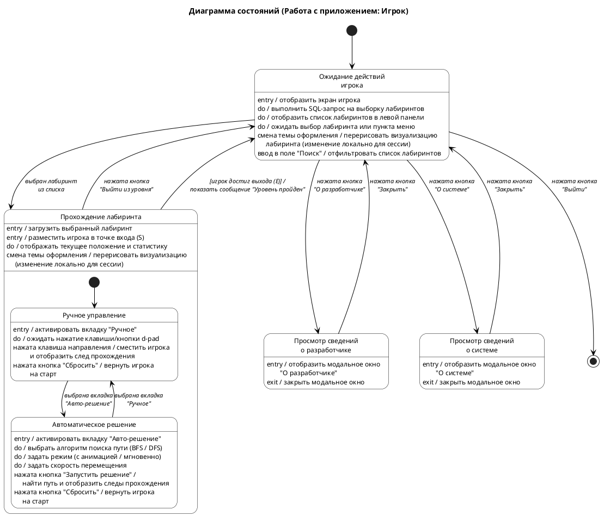

# Задача: проверить UML-диаграммы состояний

> **Инструкция для проверяющей нейросети.** Ты — независимый ревьюер. Проведи строгий критический разбор трёх диаграмм состояний UML и связанной с ними use-case диаграммы. Найди ВСЁ: баги, нарушения нотации, расхождения между артефактами, лишние или недостающие элементы, потенциальные вопросы преподавателя. Не будь вежливым — будь безжалостным. Ответь на русском.

---

## 1. Контекст проекта

**Тема курсовой:** настольное приложение «Лабиринт» — генерация и прохождение лабиринтов. Дисциплина: «Программная инженерия», Самарский университет, 6 семестр.

**Актёры:**
- **Администратор** — создаёт, просматривает, удаляет лабиринты
- **Игрок** — выбирает лабиринт из списка и проходит его (вручную стрелками или автоматически алгоритмами BFS / DFS)
- **Пользователь** — базовый актёр (авторизация, регистрация, информация о системе и разработчике)

**Архитектура UI** (важно для понимания модели):
- Экран авторизации: вкладки «Вход» и «Регистрация», поля логин/пароль/подтверждение
- Экран администратора: левый сайдбар с пунктами меню («Все лабиринты», «Создать новый», «О разработчике», «О системе», «Выйти») + основная область, переключающаяся между видами. Создание лабиринта — мастер из 3 шагов: «Параметры» → «Редактор на холсте» → «Подтверждение и сохранение». Удаление — модальное окно с подтверждением над списком.
- Экран игрока: левая панель (всегда видна — список лабиринтов, поиск, селектор темы оформления, кнопки «О разработчике»/«О системе»), центр (визуализация лабиринта + вкладки «Ручное» / «Авто-решение»), правая панель (статистика, легенда, кнопки «Сбросить» / «Выйти из уровня»).

**Темы оформления:** Зима / Лето / Осень / Весна. У админа выбирается при создании, у игрока — локально для текущей сессии (можно менять и при просмотре списка, и во время прохождения).

---

## 2. Что проверить

Нужно проверить на соответствие:
1. **Методичке препода** (требования к нотации UML state machine)
2. **Эталонному примеру** (раздел 2.5.4 курсовой другой команды — 3 аналогичные диаграммы)
3. **Use-case диаграмме** (полное взаимное покрытие)
4. **Сценариям** (текстовые описания двух use cases)
5. **UI прототипу** (HTML)
6. **Внутренней согласованности** между тремя state diagrams

---

## 3. Файлы проекта

### Созданные при выполнении задачи:
| Файл | Назначение |
|---|---|
| `state-general.puml` + `state-general.png` | Общая диаграмма состояний системы |
| `state-admin.puml` + `state-admin.png` | Диаграмма состояний для администратора |
| `state-player.puml` + `state-player.png` | Диаграмма состояний для игрока |
| `review-task.md` | Этот файл — задача проверки |

### Изменённые при выполнении задачи:
| Файл | Что добавлено |
|---|---|
| `use-case.puml` + `use-case.png` | `UC_ViewList`, `UC_Delete`, `UC_DeleteConfirm`, `UC_Theme <<extend>> UC_Play` |

### Использованные как референсы (без изменений):
| Файл | Что в нём |
|---|---|
| `scenarios.md` | Текстовые сценарии для двух use cases (Сценарий 1: «Ввести название лабиринта» — admin; Сценарий 2: «Изменить тему оформления» — player) |
| `index.html` | UI прототип (1476 строк) — три экрана: auth, admin, player |
| `3 Диаграмма состояний_2025.pdf` | Методичка препода по диаграмме состояний UML (29 слайдов) |
| `6413_Гижевская_и_Николаев_Пазлы_без_подписей_вообще.pdf` | Курсовая другой команды по теме «Пазлы» — содержит раздел 2.5.4 с эталонными диаграммами состояний |

---

## 4. Содержимое для проверки

### 4.1 `state-general.puml`



### 4.2 `state-admin.puml`



### 4.3 `state-player.puml`



### 4.4 `use-case.puml` (для сверки покрытия)

```plantuml
@startuml

top to bottom direction

skinparam usecase {
  BackgroundColor #FFFFFF
  BorderColor #000000
  FontSize 12
}
skinparam actor {
  BackgroundColor #FFFFFF
  BorderColor #000000
  FontSize 12
}
skinparam ArrowColor #000000
skinparam ArrowFontSize 11
skinparam ArrowFontStyle italic

actor "Пользователь" as User
actor "Администратор" as Admin
actor "Игрок" as Player

Admin --|> User
Player --|> User

' --- Пользователь ---
usecase "Просмотреть сведения\nо системе" as UC_InfoSys
usecase "Просмотреть сведения\nо разработчиках" as UC_InfoDev
usecase "Авторизоваться" as UC_Auth
usecase "Ввести логин" as UC_Login
usecase "Ввести пароль" as UC_Password
usecase "Зарегистрироваться" as UC_Register
usecase "Ввести подтверждение\nпароля" as UC_PasswordConfirm

' --- Общий для Админа и Игрока ---
usecase "Изменить тему\nоформления" as UC_Theme

' --- Администратор ---
usecase "Просмотреть список\nлабиринтов" as UC_ViewList
usecase "Создать лабиринт" as UC_Create
usecase "Ввести название\nлабиринта" as UC_Name
usecase "Ввести ширину\nлабиринта" as UC_Width
usecase "Ввести высоту\nлабиринта" as UC_Height
usecase "Выбрать алгоритм\nгенерации" as UC_GenAlgo
usecase "Расставить вход\nи выход" as UC_InOut
usecase "Выбрать способ\nрасстановки" as UC_InOutMode
usecase "Расставить\nавтоматически" as UC_InOutAuto
usecase "Расставить\nвручную" as UC_InOutManual
usecase "Задать вход" as UC_SetEntry
usecase "Задать выход" as UC_SetExit
usecase "Сохранить лабиринт" as UC_Save
usecase "Удалить лабиринт" as UC_Delete
usecase "Подтвердить\nудаление" as UC_DeleteConfirm

' --- Игрок ---
usecase "Выбрать лабиринт\nиз списка" as UC_Select
usecase "Пройти лабиринт" as UC_Play
usecase "Пройти вручную" as UC_Manual
usecase "Пройти автоматически" as UC_Auto
usecase "Выбрать алгоритм\nпоиска пути" as UC_PathAlgo
usecase "Настроить скорость\nперемещения" as UC_Speed
usecase "Найти путь\nв лабиринте" as UC_FindPath
usecase "Отобразить следы\nпрохождения" as UC_Trace

' Связи
User -- UC_InfoSys
User -- UC_InfoDev
User -- UC_Auth
User -- UC_Register

UC_Auth ..> UC_Login    : <<include>>
UC_Auth ..> UC_Password : <<include>>

UC_Register ..> UC_Login            : <<include>>
UC_Register ..> UC_Password         : <<include>>
UC_Register ..> UC_PasswordConfirm  : <<include>>

Admin -- UC_ViewList
Admin -- UC_Create
Admin -- UC_Save
Admin -- UC_Delete

UC_Delete ..> UC_ViewList      : <<extend>>
UC_Delete ..> UC_DeleteConfirm : <<include>>

UC_Create ..> UC_Name   : <<include>>
UC_Create ..> UC_Width  : <<include>>
UC_Create ..> UC_Height : <<include>>

UC_Theme   ..> UC_Create : <<extend>>
UC_GenAlgo ..> UC_Create : <<extend>>
UC_InOut   ..> UC_Create : <<extend>>

UC_InOut ..> UC_InOutMode        : <<include>>
UC_InOutAuto   ..> UC_InOutMode  : <<extend>>
UC_InOutManual ..> UC_InOutMode  : <<extend>>

UC_InOutManual ..> UC_SetEntry : <<include>>
UC_InOutManual ..> UC_SetExit  : <<include>>

Player -- UC_Select
Player -- UC_Play

UC_Theme ..> UC_Select : <<extend>>
UC_Theme ..> UC_Play   : <<extend>>

UC_Manual ..> UC_Play : <<extend>>
UC_Auto   ..> UC_Play : <<extend>>

UC_Auto ..> UC_PathAlgo : <<include>>
UC_Speed ..> UC_Auto    : <<extend>>
UC_Auto ..> UC_FindPath : <<include>>
UC_Auto ..> UC_Trace    : <<include>>

UC_Manual ..> UC_Trace : <<include>>

@enduml
```



### 4.5 Сценарии (`scenarios.md`) — выжимка

**Сценарий 1: «Ввести название лабиринта»** (Admin, включаемый в «Создать лабиринт»)
- Предусловие: админ авторизован, выбрал «Создать лабиринт»
- Поток: система открывает форму шага 1 «Параметры» (поля: название, ширина, высота, тема, вход/выход, алгоритм генерации) → админ кликает в поле «Название» → вводит → нажимает «Далее — Сгенерировать» → система проверяет заполненность поля.
- А1 (Отмена): система **закрывает форму создания и выводит на экран список лабиринтов**.
- А2 (пустое название): модальное окно «Введите название лабиринта», ОК → возврат к п.2 основного потока.

**Сценарий 2: «Изменить тему оформления»** (Player, расширяющий «Выбрать лабиринт из списка»)
- Предусловие: игрок на экране игрока, выбрал лабиринт. В блоке «Тема оформления» по умолчанию — тема, заданная админом.
- Поток: игрок кликает на радиокнопку темы → система выделяет её и снимает выделение с предыдущей → перерисовывает визуализацию.
- А1 (Выйти из уровня): система закрывает уровень, возвращает на экран выбора, выбранная тема **не сохраняется**.
- Постусловие: изменение действует только в рамках сессии, не сохраняется в БД.

---

## 5. Требования методички (выжимка)

**Обязательные условия построения автомата:**
- Автомат не запоминает историю
- В каждый момент автомат в одном и только одном состоянии
- Конечное число состояний
- Граф **не должен содержать изолированных состояний и переходов**
- **Не должен содержать конфликтующих переходов**

**Псевдосостояния:** начальное (`●`), конечное (`◉`), choice (ромб), junction, fork, join, history (`H`/`H*`).

**Простое состояние** может содержать:
- `entry / <action>` — выполняется при входе (мгновенное действие)
- `exit / <action>` — выполняется при выходе (мгновенное действие)
- `do / <activity>` — длительная активность пока находимся в состоянии
- `include <submachine>` — обращение к подавтомату
- `<event> / defer` — отложенное событие

**Activity (длительная)** ↔ `do`. **Action (мгновенная)** ↔ `entry`/`exit`.

**Имя состояния:** глагол в настоящем времени или причастие, с заглавной буквы, уникальное.

**Простой переход:** `<событие> [<условие>] / <действие>`

**Конфликтующие переходы** (стр.14): два или более перехода из одного состояния с одним триггером и разными guard'ами. **Решение** — использовать `<<choice>>` псевдосостояние.

**Составное состояние** — содержит регионы с подсостояниями. Может быть:
- с последовательными подсостояниями (только одно активно)
- с параллельными подсостояниями (несколько активно одновременно — fork/join)
- со скрытой внутренней структурой (символ `oo` внутри)

**Историческое состояние** — оправдано только когда нужна обработка прерываний без потери данных.

**Рекомендации (стр.29):**
- Длительность срабатывания переходов должна быть **существенно меньшей**, чем время в состояниях
- Все переходы должны быть **явно специфицированы**
- Объект всегда в одном состоянии
- Проверять отсутствие конфликтов
- При параллельности заменять конфликтующие переходы fork

---

## 6. Эталонный пример (раздел 2.5.4)

В приложенной курсовой по теме «Пазлы» есть три аналогичные диаграммы:

**Рисунок 41 — общая часть.** Линейная цепочка: `Установить соединение с БД` → `Авторизация пользователя` (composite-style с entry/do/exit) → ветка по роли в `Работа: Админ` или `Работа: Игрок` → `Завершение работы`. Self-loop на «Данные некорректны». Ветка «Соединение не установлено» напрямую в Завершение.

**Рисунок 42 — для администратора.** Hub `Ожидание действий администратора` в центре, лучи в составные состояния: «Просмотр галереи» (→ «Добавление картинки» цепочкой), «Работа с категориями» (→ «Изменение игры»), «Работа с уровнями сложности» (→ «Изменение игры»), «Добавление игры». Каждое состояние с `entry/do/exit`. Выход — `Esc` → final.

**Рисунок 43 — для игрока.** Hub `Ожидание действий игрока` с лучами: «Сохранённые игры», «Игры по категориям», «Игры по уровню сложности», «Настройки», «Просмотр рейтинга», «Справочная информация о системе», «Справочная информация о разработчиках», «Игра» (центральный режим, доступен из нескольких источников).

**Ключевые паттерны примера:**
- Hub-and-spokes для каждой роли
- Каждое состояние имеет `entry/do/exit`
- Подписи на русском, в стиле «Выбрана вкладка X», «Нажата кнопка Y»
- **SQL-операции записи** (`INSERT INTO ...`, `DELETE FROM ...`) **на переходах** с прикреплёнными note-блоками
- **SQL-операции чтения** (`SELECT`) — внутри `do` состояния
- Авторизация — одно состояние без разделения вход/регистрация
- Имена — отглагольные сущ./причастия

---

## 7. Чеклист для проверки

Прогони эти проверки строго и для КАЖДОЙ диаграммы:

### 7.1 Соответствие методичке
- [ ] Есть начальное и конечное псевдосостояния
- [ ] Все имена состояний — отглагольные сущ./причастия, уникальные, с заглавной буквы
- [ ] У всех нетривиальных состояний есть `entry/do/exit` секции (минимум одна)
- [ ] `entry`/`exit` содержат только мгновенные действия (отображение, закрытие, инициализация, SQL-операции записи можно вынести на переход)
- [ ] `do` содержит только длительные активности (ожидание ввода, отображение динамических данных, SQL-чтение)
- [ ] Все переходы помечены (триггер, guard или action)
- [ ] **Нет конфликтующих переходов**: same trigger + разные guards → должен быть choice
- [ ] **Нет изолированных** состояний и переходов
- [ ] Длительность переходов << времени в состояниях
- [ ] Composite states используются для логической группировки
- [ ] Internal transitions (без целевого состояния) для действий, не меняющих состояние (поиск, переключение темы, сброс)
- [ ] History pseudo-state не используется без явного обоснования прерываниями

### 7.2 Соответствие эталонному примеру
- [ ] Общая диаграмма — линейная цепочка: запуск → авторизация → работа → завершение
- [ ] Per-role диаграммы — hub-and-spokes структура
- [ ] Авторизация — одно состояние с entry/do/exit (не разделённое на вход/регистрацию)
- [ ] SQL-write на переходах
- [ ] SQL-read в `do`
- [ ] Подписи переходов в стиле «нажата кнопка X», «выбран пункт меню Y»
- [ ] Все подписи на русском

### 7.3 Соответствие use-case диаграмме
- [ ] **Каждый** UC из use-case.puml имеет отражение в state diagram (либо как состояние, либо как триггер/действие на переходе, либо как do-активность внутри состояния)
- [ ] **Каждое** состояние state diagram имеет основание либо в UC, либо в UI прототипе
- [ ] Связи `<<include>>` отражены: включаемые UCs → действия внутри включающего состояния
- [ ] Связи `<<extend>>` отражены: расширяющие UCs → необязательные ветки/действия

### 7.4 Соответствие сценариям
- [ ] Сценарий 1 «Ввести название лабиринта»:
  - Шаг 1 wizard'а с полями отражён
  - Кнопка «Далее» с проверкой → choice diamond
  - А1 «Отмена» → возврат **в список лабиринтов** (не в hub!)
  - А2 «пустое название» → возврат к шагу 1
- [ ] Сценарий 2 «Изменить тему оформления»:
  - Возможность смены темы есть и в состоянии выбора, и в состоянии прохождения
  - Перерисовка как действие на internal transition
  - А1 «Выйти из уровня» → возврат к выбору без сохранения темы

### 7.5 Внутренняя согласованность
- [ ] `Работа: Админ` в общей ↔ начальное состояние state-admin
- [ ] `Работа: Игрок` в общей ↔ начальное состояние state-player
- [ ] Кнопка «Выйти» в обеих per-role диаграммах ведёт к финалу, что соответствует `→ Завершение` в общей
- [ ] Имена состояний не дублируются между диаграммами без причины

### 7.6 PlantUML синтаксис и рендер
- [ ] Файлы валидны (компилируются без ошибок)
- [ ] Диаграммы читаемы (нет наложений, обрезаний)
- [ ] Choice diamond отрисовывается корректно
- [ ] Composite states имеют визуальную рамку

---

## 8. Что особенно проверить (мои подозрения)

Опытный ревьюер должен особенно внимательно посмотреть на эти точки:

1. **Конфликты completion-переходов в общей диаграмме.** `Запуск приложения` имеет 2 исходящих с guards (соединение есть/нет), `Авторизация` имеет 3 исходящих с guards (некорректные / админ / игрок). Технически same implicit trigger (completion of do) + разные guards. Считается ли это конфликтом по строгой методичке? Эталонная страница 25 методички использует ровно тот же паттерн без choice — но это может быть нестрого.

2. **`exit / закрыть форму списка`** в state-admin срабатывает на ВСЕХ исходящих переходах из `СписокЛабиринтов`, включая переход в `УдалениеЛабиринта` (модалка над списком, форма НЕ закрывается). Семантически некорректно.

3. **`UC_Save` — отдельный admin UC, но в state diagram моделируется как часть `Создание лабиринта`** (через переход `Сохранение → [*]` с действием INSERT). Несовпадение level of abstraction.

4. **`Прохождение → Ожидание [игрок достиг выхода]`** — guard на completion transition без явного триггера. Возможно, лучше явный триггер «достижение точки выхода».

5. **`Работа: Админ` и `Работа: Игрок` в общей** имеют только `include / Диаграмма состояний (...)` строку. Должны ли они быть визуально помечены как составные (composite со скрытой структурой по стр.21 методички, символ `oo`)? PlantUML это напрямую не поддерживает.

6. **Доступ к «О разработчике»/«О системе» во время прохождения у игрока** — в UI они доступны (кнопки в левой панели всегда видны), но в state-player эти состояния достижимы только из `Ожидание`. Сознательное упрощение по образцу эталона. Допустимо?

7. **`УдалениеЛабиринта` как state на одном уровне со `СписокЛабиринтов`** vs. вложенным сабстейтом списка. UI: модалка над списком, фактически админ всё ещё «в списке». Может, логичнее вложить.

8. **`entry / отобразить таблицу лабиринтов`** в `СписокЛабиринтов` — отображение мгновенное, но идёт после SQL SELECT который тоже в `do`. Порядок выполнения и соответствие entry/do/exit семантике.

---

## 9. Формат ответа

Дай ответ в следующей структуре:

```markdown
## Найденные проблемы

### 🔴 Критичные (нарушение методички / use-case / сценариев)
1. [файл:строка] Описание проблемы. Почему критично. Как исправить.
...

### 🟡 Предупреждения (нестрогие нарушения, спорные места)
1. [файл:строка] Описание. Контр-аргумент. Альтернатива.
...

### 🔵 Незначительные (стилистика, мелочи)
1. ...

## Что упущено
- [конкретные UC / сценарии / UI элементы, которые не отражены в state diagrams]

## Что лишнего  
- [конкретные элементы state diagrams, которые не подкреплены use-case / scenarios / UI]

## Конкретные правки
[markdown с предлагаемыми diff'ами или новыми строками]

## Финальный вердикт
Готово к сдаче / Требует доработки. Основания.
```

**Не щади. Цель — найти ВСЁ, что препод может ткнуть.**
