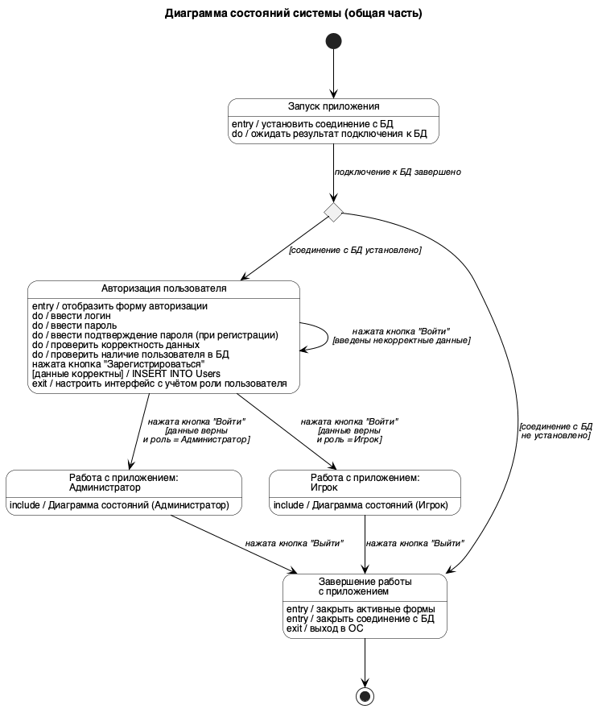
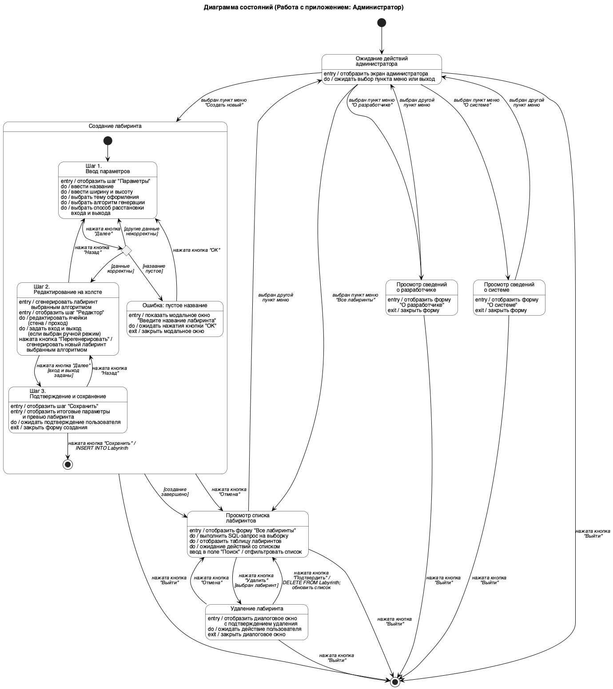
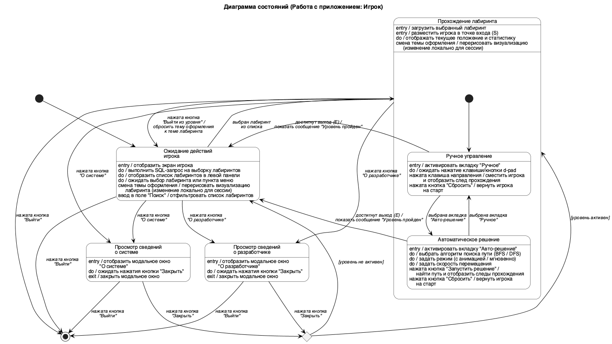

## 2.4.4 Диаграмма состояний

Главное назначение диаграммы состояний – описать возможные последовательности состояний и переходов, которые в совокупности характеризуют поведение моделируемой системы в течение всего её жизненного цикла. Диаграмма состояний представляет динамическое поведение сущностей на основе спецификации их реакции на восприятие некоторых конкретных событий. Системы, которые реагируют на внешние действия от других систем или от пользователей, иногда называют реактивными. Если такие действия инициируются в произвольные случайные моменты времени, то говорят об асинхронном поведении модели [?].

Поскольку разрабатываемая система имеет две роли пользователей – администратора и игрока – с существенно различающимися сценариями работы, её поведение описывается тремя диаграммами состояний. Обобщённая диаграмма описывает общий жизненный цикл приложения (запуск, авторизация, завершение работы) и включает два подавтомата, соответствующих работе с приложением в роли администратора и в роли игрока. Каждый подавтомат вынесен в отдельную диаграмму и детализирует поведение системы в соответствующем режиме.

На рисунке 20 представлена обобщённая диаграмма состояний системы. Цепочка переходов начинается с состояния «Запуск приложения», в котором при входе устанавливается соединение с базой данных и ожидается результат подключения. После завершения подключения управление передаётся псевдосостоянию выбора: если соединение с БД не установлено, система переходит в состояние «Завершение работы с приложением» и выход в операционную систему происходит без дальнейшего взаимодействия с пользователем; в противном случае осуществляется переход в состояние «Авторизация пользователя». В этом состоянии отображается форма авторизации, пользователь вводит логин и пароль (а в режиме регистрации – также подтверждение пароля), после чего система проверяет корректность данных и их наличие в базе. При нажатии кнопки «Зарегистрироваться» и корректных данных в таблицу пользователей выполняется операция вставки записи. При нажатии кнопки «Войти» возможны три варианта: при некорректных данных система остаётся в состоянии «Авторизация» для повторного ввода, а при корректных данных переход осуществляется либо в составное состояние «Работа с приложением: Администратор», либо в составное состояние «Работа с приложением: Игрок» – в зависимости от роли пользователя. Из обоих ролевых состояний по нажатию кнопки «Выйти» система переходит в состояние «Завершение работы с приложением», в котором закрываются активные формы, разрывается соединение с БД и выполняется выход в операционную систему.

Рисунок 20 – Диаграмма состояний системы (общая часть)

На рисунке 21 приведена диаграмма состояний системы для пользователя «Администратор». По умолчанию система находится в состоянии «Ожидание действий администратора», в котором отображается главный экран администратора и ожидается выбор пункта меню. При выборе пункта меню «Все лабиринты» осуществляется переход в состояние «Просмотр списка лабиринтов», где выполняется SQL-запрос на выборку, отображается таблица лабиринтов и поддерживается фильтрация по полю «Поиск». Из этого состояния по нажатию кнопки «Удалить» при выбранной строке происходит переход в состояние «Удаление лабиринта», в котором отображается модальное окно подтверждения: при нажатии кнопки «Подтвердить» выполняется SQL-операция удаления записи из таблицы лабиринтов и обновление списка, а при нажатии кнопки «Отмена» система возвращается к списку без изменений. При выборе пункта меню «Создать новый» осуществляется переход в составное состояние «Создание лабиринта», которое включает три последовательных подсостояния – «Шаг 1. Ввод параметров», «Шаг 2. Редактирование на холсте» и «Шаг 3. Подтверждение и сохранение». В подсостоянии «Ввод параметров» администратор задаёт название, размеры, тему оформления, алгоритм генерации и способ расстановки входа и выхода, после чего по нажатию кнопки «Далее» выполняется переход к псевдосостоянию выбора, проверяющему корректность введённых данных: при пустом названии лабиринта отображается модальное окно ошибки, при других некорректных значениях происходит возврат в то же подсостояние для повторного ввода, а при корректных данных осуществляется переход в подсостояние «Редактирование на холсте». В этом подсостоянии лабиринт генерируется выбранным алгоритмом, администратор редактирует ячейки и при необходимости задаёт вход и выход вручную, имея возможность перегенерировать лабиринт или вернуться к параметрам. По нажатию кнопки «Далее» при заданных входе и выходе происходит переход в подсостояние «Подтверждение и сохранение», где отображаются итоговые параметры и превью лабиринта; при нажатии кнопки «Сохранить» выполняется SQL-операция вставки записи в таблицу лабиринтов, составное состояние завершается, и администратор возвращается к списку лабиринтов. При выборе пунктов меню «О разработчике» и «О системе» осуществляются переходы в состояния «Просмотр сведений о разработчике» и «Просмотр сведений о системе» соответственно, из которых возврат в состояние ожидания происходит при выборе другого пункта меню. Из любого состояния режима администратора по нажатию кнопки «Выйти» происходит выход из подавтомата в обобщающую диаграмму, откуда управление передаётся в состояние «Завершение работы с приложением».

Рисунок 21 – Диаграмма состояний (Работа с приложением: Администратор)

На рисунке 22 приведена диаграмма состояний системы для пользователя «Игрок». По умолчанию система находится в состоянии «Ожидание действий игрока», в котором отображается экран игрока, выполняется SQL-запрос на выборку доступных лабиринтов и список отображается в левой панели. В этом состоянии поддерживаются две внутренние реакции: смена темы оформления, вызывающая перерисовку визуализации (изменение действует локально для сессии), и ввод в поле «Поиск», вызывающий фильтрацию списка лабиринтов. При выборе лабиринта из списка осуществляется переход в составное состояние «Прохождение лабиринта», в котором загружается выбранный лабиринт, игрок помещается в точку входа и отображается статистика прохождения. Составное состояние включает два последовательных подсостояния, соответствующих вкладкам интерфейса: «Ручное управление» и «Автоматическое решение». В подсостоянии «Ручное управление» система ожидает нажатия клавиш направлений или кнопок d-pad, после чего смещает игрока и отображает след прохождения; нажатие кнопки «Сбросить» возвращает игрока на старт. В подсостоянии «Автоматическое решение» игрок выбирает алгоритм поиска пути (BFS или DFS), режим отображения (с анимацией или мгновенно) и скорость перемещения, после чего нажатие кнопки «Запустить решение» приводит к поиску пути и отображению следов прохождения. Переключение между подсостояниями осуществляется выбором соответствующей вкладки. В обоих подсостояниях при достижении точки выхода отображается сообщение «Уровень пройден» и происходит возврат в состояние «Ожидание действий игрока»; тот же возврат выполняется по нажатию кнопки «Выйти из уровня», при этом тема оформления сбрасывается к теме, заданной при создании лабиринта. Из состояний «Ожидание действий игрока» и «Прохождение лабиринта» по нажатию кнопок «О разработчике» и «О системе» осуществляются переходы в одноимённые состояния просмотра сведений, отображающие модальные окна. После закрытия модального окна управление передаётся псевдосостоянию выбора, которое возвращает систему в состояние «Прохождение лабиринта», если уровень был активен на момент открытия окна, либо в состояние «Ожидание действий игрока» в противном случае. Из любого состояния режима игрока по нажатию кнопки «Выйти» происходит выход из подавтомата в обобщающую диаграмму, откуда управление передаётся в состояние «Завершение работы с приложением».

Рисунок 22 – Диаграмма состояний (Работа с приложением: Игрок)

---

**Примечание для вставки в docx.** После добавления двух новых рисунков (21 и 22) номера всех последующих рисунков в пояснительной записке сдвигаются на +2: «Рисунок 21 – Диаграмма деятельности…» становится «Рисунок 23 – …», «Рисунок 22 – Диаграмма последовательности…» становится «Рисунок 24 – …», и так далее до конца документа. Ссылки в тексте на эти рисунки также необходимо обновить.
