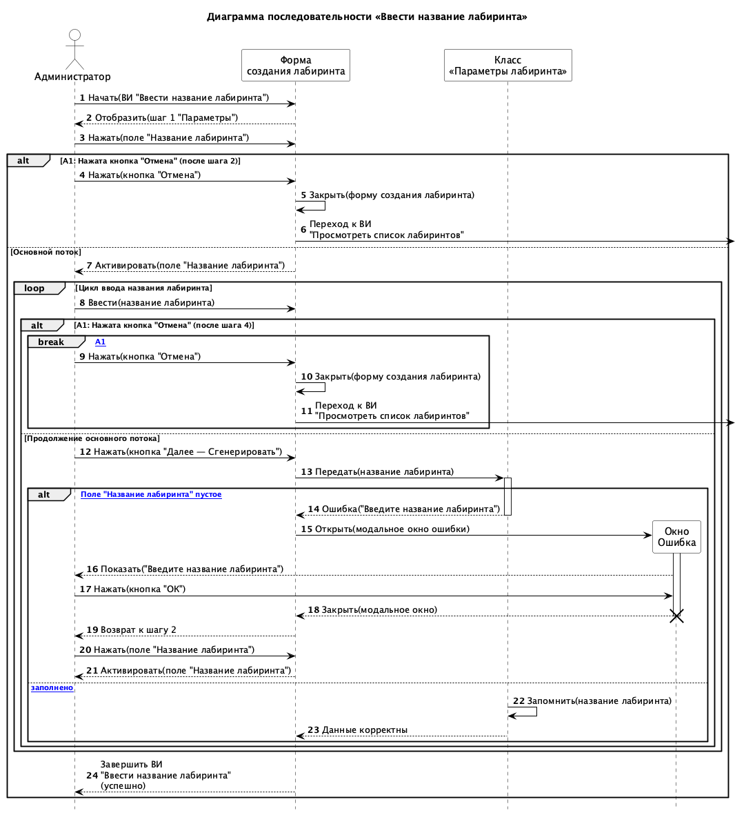
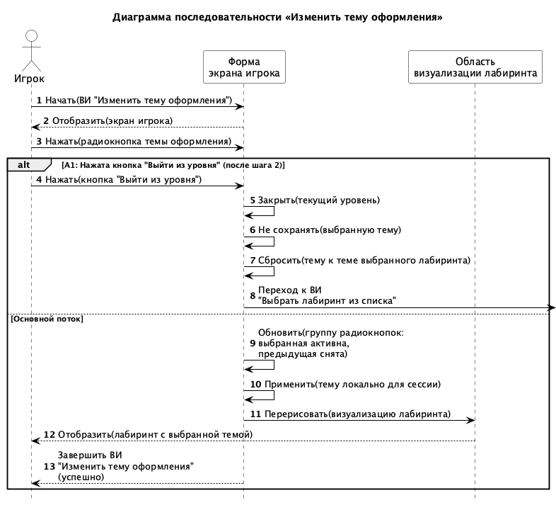

## 2.4.6 Диаграмма последовательности

Диаграмма последовательности UML (sequence diagram) — такая диаграмма, на которой показаны взаимодействия объектов, упорядоченные по времени их проявления. Основные элементы диаграммы последовательности — это: обозначения объектов, вертикальные линии и сообщения между ними [?]. На рисунках N и N приведены диаграммы последовательности системы для вариантов использования «Ввести название лабиринта» и «Изменить тему оформления» соответственно. Диаграммы построены на основании сценариев, приведённых в п. 2.4.3.

Рисунок N – Диаграмма последовательности «Ввести название лабиринта»

Рисунок N – Диаграмма последовательности «Изменить тему оформления»
