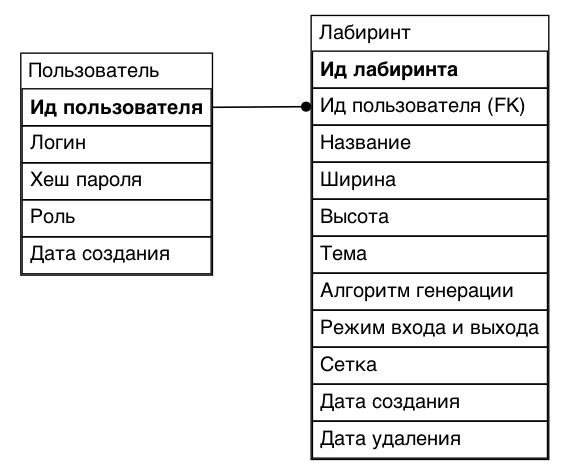
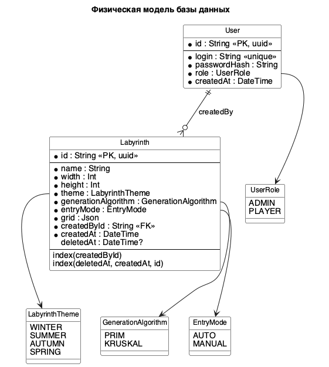

## 2.5 Логическая модель данных

Логическая информационная модель представляет данные с учетом способа их логического хранения в памяти ЭВМ. При построении модели базы данных используются понятия сущности, атрибута и ключа. Сущность является объектом предметной области, который можно отличить от других объектов по набору признаков. Атрибут задает свойство сущности, а ключ используется для однозначной идентификации экземпляра сущности.

Логическая модель БД разрабатываемой системы приведена на рисунке N.

Рисунок N – Логическая модель данных

Физическая модель базы данных, построенная по схеме Prisma, приведена на рисунке N.

Рисунок N – Физическая модель базы данных

Описание объектов рассматриваемой предметной области, которые хранятся в базе данных, приведено в таблицах N-N.

Таблица N – Сущность «Пользователь»

| Идентификатор | Тип данных | Описание |
| --- | --- | --- |
| Ид пользователя | Строка | Уникальный идентификатор пользователя |
| Логин | Строка | Логин пользователя, используемый для входа в систему |
| Хеш пароля | Строка | Пароль пользователя, преобразованный в хешированную строку |
| Роль | Перечисление | Роль пользователя в системе: администратор или игрок |
| Дата создания | Дата и время | Дата и время создания учетной записи |

Таблица N – Сущность «Лабиринт»

| Идентификатор | Тип данных | Описание |
| --- | --- | --- |
| Ид лабиринта | Строка | Уникальный идентификатор лабиринта |
| Ид пользователя (FK) | Строка | Идентификатор пользователя, создавшего лабиринт |
| Название | Строка | Название лабиринта |
| Ширина | Целое | Ширина сетки лабиринта |
| Высота | Целое | Высота сетки лабиринта |
| Тема | Перечисление | Тема оформления лабиринта |
| Алгоритм генерации | Перечисление | Алгоритм, использованный при генерации лабиринта |
| Режим входа и выхода | Перечисление | Способ расстановки входа и выхода |
| Сетка | Массив данных | Структура клеток лабиринта |
| Дата создания | Дата и время | Дата и время создания лабиринта |
| Дата удаления | Дата и время | Дата и время удаления лабиринта |

Физическая таблица `User` содержит первичный ключ `id`, уникальный индекс по `login`, хеш пароля, роль и дату создания. Физическая таблица `Labyrinth` содержит первичный ключ `id`, внешний ключ `createdById`, параметры лабиринта, JSON-поле `grid`, дату создания и nullable-поле `deletedAt` для мягкого удаления. Для ускорения выборки используются индексы `createdById` и составной индекс `deletedAt, createdAt, id`.
