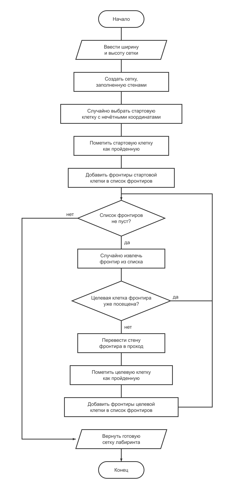
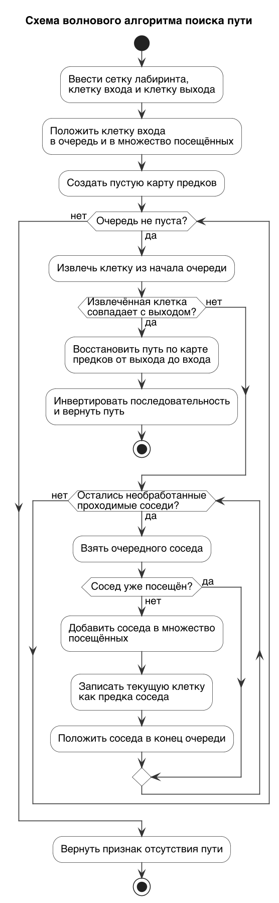

## 2.6 Разработка и описание алгоритмов обработки данных

Алгоритм – это точный набор инструкций, описывающих порядок действий некоторого исполнителя для достижения результата, решения некоторой задачи за конечное время. Схема алгоритма является формой представления алгоритма с помощью графических символов. Графические символы, их размеры, а также правила построения блок-схем определены государственными стандартами [5].

Составление схемы алгоритма является важным и необходимым этапом решения задачи. Но, т.к. в таком виде алгоритм не может быть выполнен непосредственно ЭВМ, этот этап является промежуточным, значительно облегчающим процесс составления программы [4].

В системе «Лабиринт» разработаны и реализованы четыре алгоритма обработки данных: алгоритм генерации лабиринта методом Прима, алгоритм генерации лабиринта методом Краскала, волновой алгоритм поиска пути и алгоритм прохождения методом правой руки. Алгоритмы генерации применяются на стороне сервера при создании лабиринта администратором, алгоритмы поиска пути — при автоматическом прохождении лабиринта игроком. В настоящем разделе подробно рассмотрены два базовых алгоритма системы — алгоритм генерации лабиринта методом Прима и волновой алгоритм поиска пути.

### 2.6.1 Алгоритм генерации лабиринта методом Прима

Алгоритм генерации лабиринта методом Прима строит остовное дерево проходов по двумерной сетке клеток. Сетка имеет нечётные размеры по ширине и высоте в диапазоне от 7 до 25. Клетки с нечётными координатами по обеим осям трактуются как «комнаты», клетки между ними — как стены, которые в результате работы алгоритма могут быть переведены в проход. Входными данными алгоритма являются ширина и высота сетки. Результатом работы алгоритма является сетка лабиринта, в которой все «комнаты» связаны между собой единственным остовным деревом проходов, а оставшиеся стены образуют толстостенную структуру.

На рисунке N представлена схема алгоритма генерации лабиринта методом Прима. Реализованный алгоритм состоит из следующих этапов.

Этап 1. Инициализация сетки лабиринта.

Создаётся двумерный массив указанных размеров, все клетки которого помечаются как стены. Этот массив используется как рабочая сетка лабиринта на всех последующих этапах.

Этап 2. Выбор стартовой «комнаты» и начального списка фронтиров.

Случайным образом выбирается «комната» с нечётными координатами по обеим осям. Стартовая клетка помечается как пройденная и переводится в состояние прохода. Для стартовой клетки формируется начальный список фронтиров. Фронтир описывает пару из стены и целевой клетки, отстоящей от текущей «комнаты» на два шага в одном из четырёх направлений. В список добавляются фронтиры всех соседних непосещённых «комнат», расположенных внутри сетки.

Этап 3. Обработка списка фронтиров.

Пока список фронтиров не пуст, из списка случайным образом извлекается один фронтир, и выполняются следующие последовательные шаги:

− если целевая клетка извлечённого фронтира уже была посещена ранее, фронтир пропускается, и выполняется переход к следующей итерации;

− иначе стена между текущей и целевой клетками переводится в состояние прохода, целевая клетка помечается как пройденная, и в список добавляются фронтиры её непосещённых соседей.

Случайный выбор фронтира на каждой итерации обеспечивает равномерное ветвление проходов и отсутствие предпочтительных направлений построения. Использование шага в две клетки между «комнатами» гарантирует, что стены между несоседними «комнатами» сохраняются, и итоговая сетка остаётся толстостенной.

Этап 4. Завершение работы алгоритма.

После опустошения списка фронтиров алгоритм завершается, и построенная сетка лабиринта возвращается как результат.

Рисунок N – Схема алгоритма генерации лабиринта методом Прима

### 2.6.2 Волновой алгоритм поиска пути

Волновой алгоритм поиска пути находит кратчайший путь от заданной клетки входа до заданной клетки выхода в сетке лабиринта. Алгоритм основан на поиске в ширину и рассматривает сетку лабиринта как невзвешенный граф, в котором вершинами являются проходимые клетки, а рёбрами — переходы между соседними проходимыми клетками по четырём направлениям. Входными данными алгоритма являются сетка лабиринта, координата клетки входа и координата клетки выхода. Результатом работы алгоритма является последовательность координат клеток от входа до выхода либо признак отсутствия пути.

На рисунке N представлена схема волнового алгоритма поиска пути. Реализованный алгоритм состоит из следующих этапов.

Этап 1. Инициализация структур данных.

Создаётся очередь клеток для обхода и множество посещённых клеток. В очередь и в множество посещённых помещается клетка входа. Создаётся пустая карта предков, в которой каждой посещённой клетке сопоставляется клетка, из которой она была достигнута.

Этап 2. Обход клеток лабиринта в ширину.

Пока очередь не пуста, из её начала извлекается текущая клетка, и выполняются следующие последовательные шаги:

− если текущая клетка совпадает с клеткой выхода, выполняется переход к этапу восстановления пути;

− иначе для текущей клетки перебираются её проходимые соседи по четырём направлениям. Соседями считаются клетки сетки, не являющиеся стенами. Каждый сосед, ещё не помеченный как посещённый, добавляется в множество посещённых, для него в карте предков фиксируется текущая клетка, и сосед помещается в конец очереди.

Этап 3. Восстановление найденного пути.

Восстановление пути выполняется проходом по карте предков от клетки выхода назад к клетке входа: на каждом шаге берётся клетка, сохранённая в карте предков как предок текущей. Полученная последовательность инвертируется и возвращается в направлении от входа к выходу.

Этап 4. Обработка случая отсутствия пути.

Если очередь опустошается до достижения клетки выхода, алгоритм завершается и возвращает признак отсутствия пути.

Использование очереди клеток с обходом в порядке поступления гарантирует, что клетка выхода будет достигнута через минимальное число переходов. Это позволяет применять волновой алгоритм для нахождения кратчайшего пути и подсчёта минимального числа шагов прохождения лабиринта. Альтернативный алгоритм прохождения, реализованный в системе, — метод правой руки. Он двигается вдоль стены и не требует хранения карты предков, однако не гарантирует нахождения выхода для лабиринтов с неподходящей структурой проходов и используется в системе в качестве вспомогательного.

Рисунок N – Схема волнового алгоритма поиска пути
