## 3.1 Разработка и описание интерфейса пользователя

Пользовательский интерфейс системы «Лабиринт» реализован как web-приложение. После запуска приложения пользователь попадает на экран авторизации. На форме расположены вкладки входа и регистрации, поля для ввода логина и пароля, а также кнопка выполнения выбранного действия. После успешной авторизации система определяет роль пользователя и открывает соответствующий интерфейс администратора или игрока.

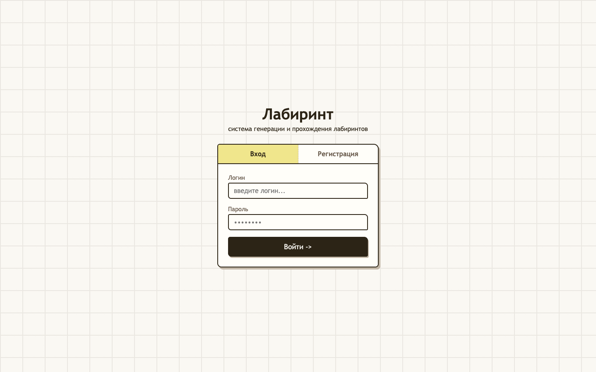

Рисунок N – Экран авторизации

При входе с ролью администратора открывается экран управления лабиринтами. В левой части интерфейса расположено меню администратора, а в основной области отображается список созданных лабиринтов. Администратор может просматривать лабиринты, выполнять поиск по названию, удалять записи и переходить к созданию нового лабиринта.

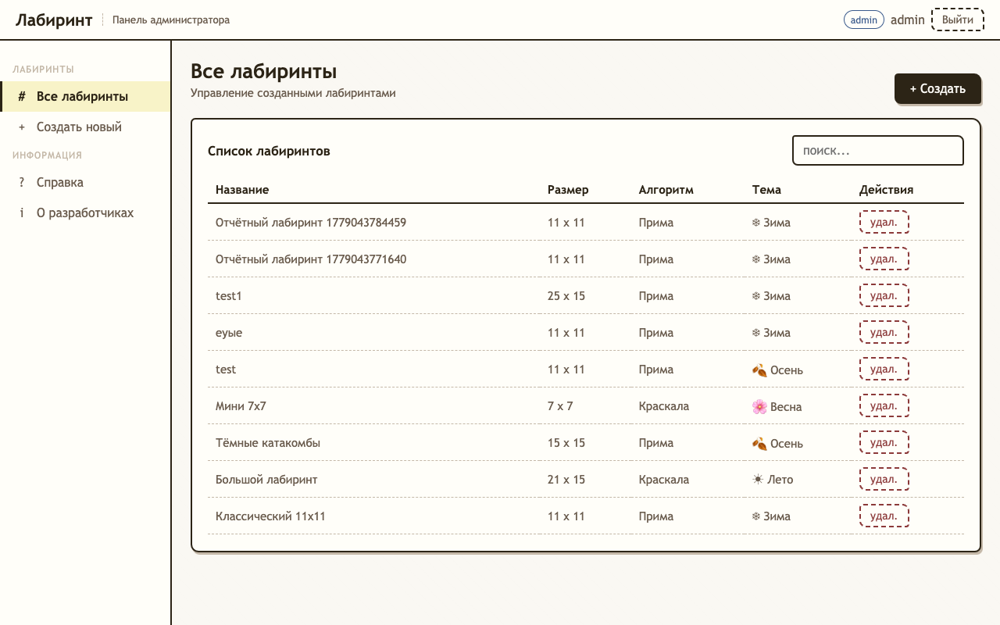

Рисунок N – Экран администратора со списком лабиринтов

Создание лабиринта выполнено в виде мастера из трех шагов. На первом шаге администратор задает название лабиринта, ширину, высоту, тему оформления, алгоритм генерации и способ расстановки входа и выхода. Название проверяется до перехода к следующим шагам, чтобы пользователь не потерял введенные данные после поздней ошибки сохранения.

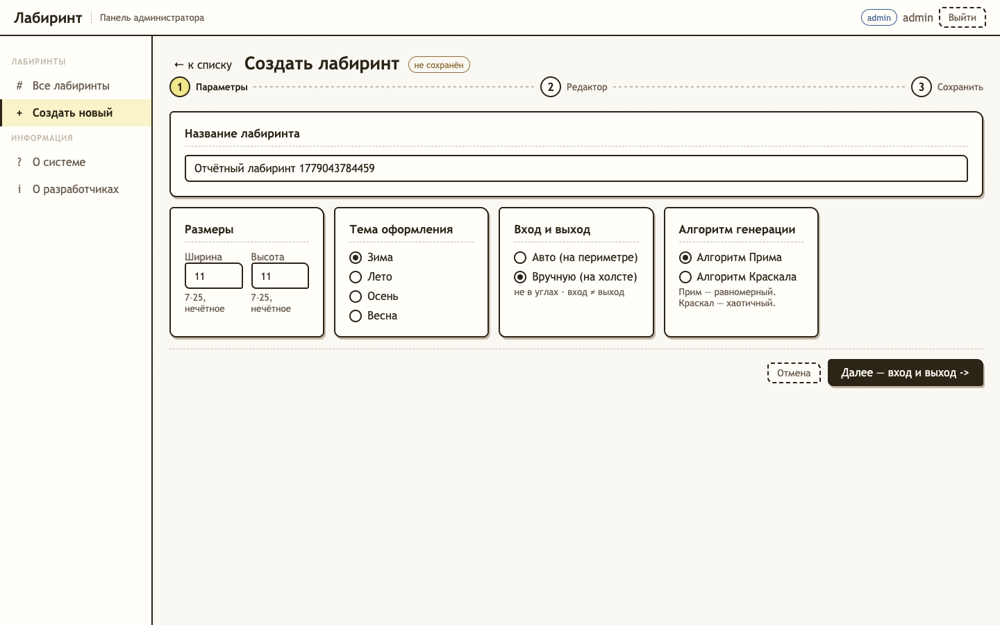

Рисунок N – Форма создания лабиринта: параметры

Если выбран ручной режим расстановки входа и выхода, на втором шаге отображается поле с рамкой лабиринта и подсвеченными допустимыми позициями на периметре. На этом этапе доступны только инструменты установки входа и выхода. Стены и проходы не редактируются до генерации, так как генерация должна выполняться после выбора начальной и конечной точек.

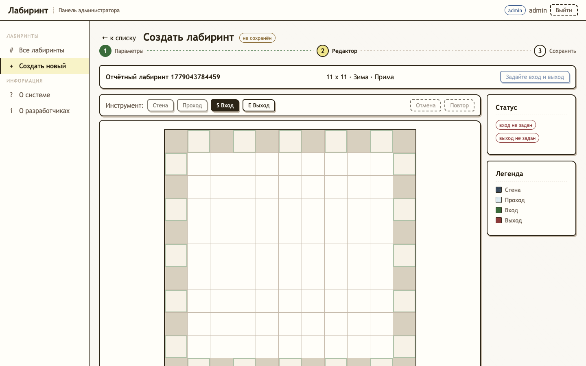

Рисунок N – Редактор лабиринта до генерации

После выбора входа и выхода администратор запускает генерацию лабиринта отдельной кнопкой. В сгенерированном лабиринте отображаются стены, проходы, вход и выход. После генерации становятся доступны инструменты редактирования стен и проходов, а также операции отмены и повтора действия. При попытке создать изолированную область система сразу выводит сообщение об ошибке и не применяет изменение.

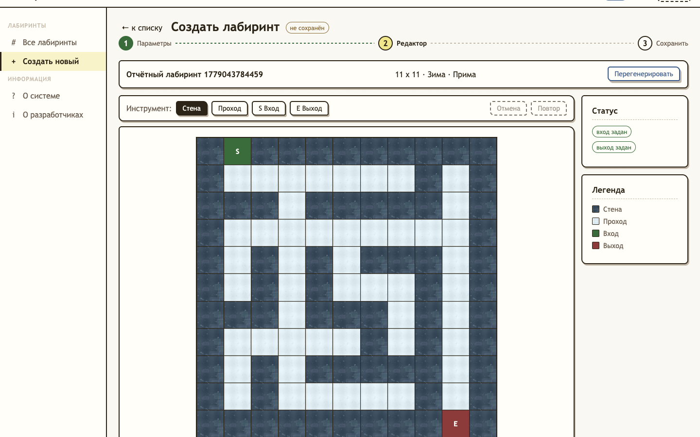

Рисунок N – Редактор сгенерированного лабиринта

На третьем шаге отображается форма подтверждения сохранения лабиринта. На ней показываются итоговые параметры, выбранная тема, алгоритм генерации и миниатюрное представление сетки. После подтверждения система сохраняет лабиринт в базе данных и возвращает администратора к списку лабиринтов.

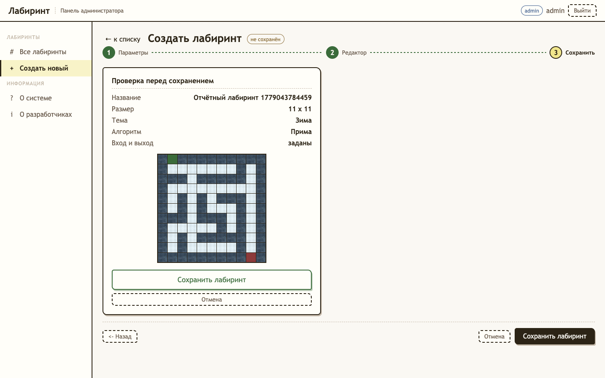

Рисунок N – Подтверждение и сохранение лабиринта

Удаление лабиринта выполняется через модальное окно подтверждения. Такой подход снижает риск случайного удаления записи. Если пользователь подтверждает действие, лабиринт помечается удаленным и исчезает из активного списка.

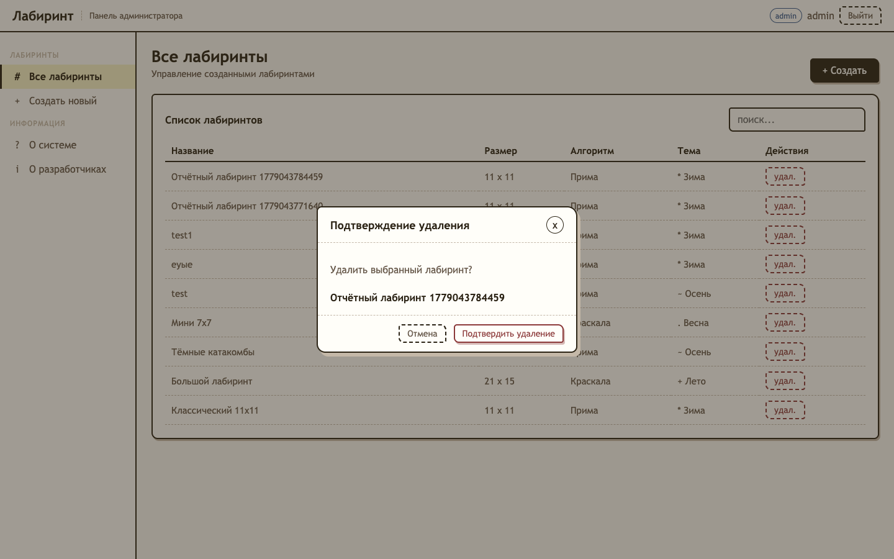

Рисунок N – Модальное окно удаления лабиринта

При входе с ролью игрока открывается экран прохождения лабиринтов. В левой части отображается список доступных лабиринтов, поиск и выбор темы оформления. Центральная область предназначена для визуализации выбранного лабиринта, а правая панель содержит статистику прохождения, легенду и кнопки управления попыткой.

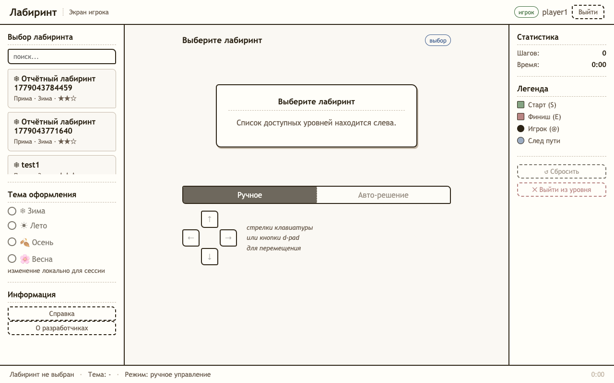

Рисунок N – Экран игрока со списком лабиринтов

В ручном режиме игрок перемещается по лабиринту с помощью кнопок управления или клавиатуры. На поле отображается текущая позиция игрока и след прохождения. Если игрок возвращается из тупика, лишняя ветка следа очищается, а счетчик шагов соответствует видимому очищенному пути.

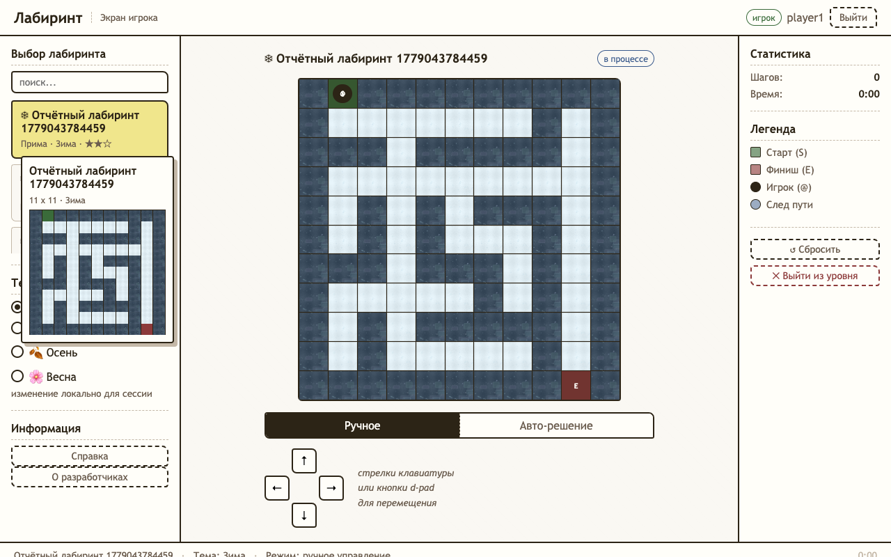

Рисунок N – Ручное прохождение лабиринта

В режиме автоматического решения игрок выбирает алгоритм построения пути: волновой алгоритм или метод правой руки. Также можно выбрать мгновенное отображение результата или анимацию. Скорость анимации изменяется во время движения без повторного запуска решения.

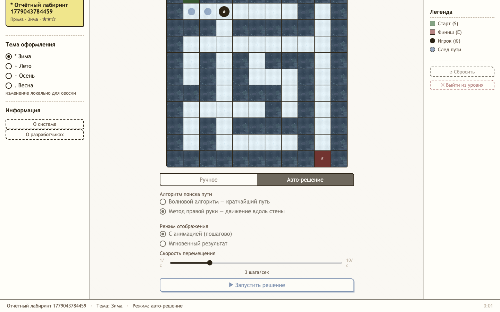

Рисунок N – Автоматическое решение лабиринта

После достижения выхода система отображает окно завершения уровня. В нем показываются количество шагов и время прохождения. После закрытия окна игрок может выбрать другой лабиринт или сбросить текущую попытку.

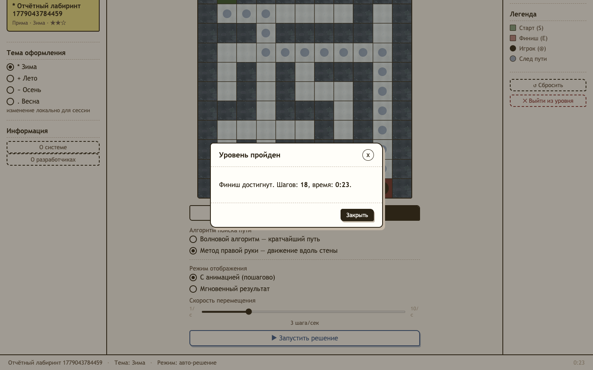

Рисунок N – Окно завершения уровня

Справочная информация о системе оформлена как иллюстрированное руководство пользователя и разделена на две отдельные страницы — для администратора и для игрока. Каждая страница открывается из меню соответствующей роли в новой вкладке браузера и содержит пошаговое описание работы со скриншотами экранов. Страница справки администратора описывает список лабиринтов, создание лабиринта по шагам мастера и удаление (см. рисунок N).

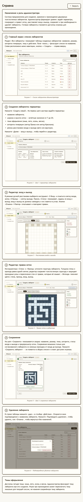

Рисунок N – Страница справки

Страница справки игрока описывает выбор лабиринта, ручное прохождение, автоматическое решение и завершение уровня со статистикой (см. рисунок N).

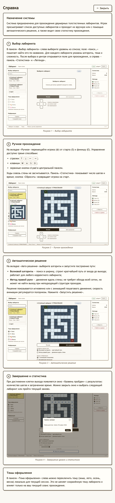

Рисунок N – Страница справки

Сведения о разработчиках отображаются в отдельном модальном окне. Модальное окно открывается поверх текущего экрана и не сбрасывает состояние работы администратора или игрока.

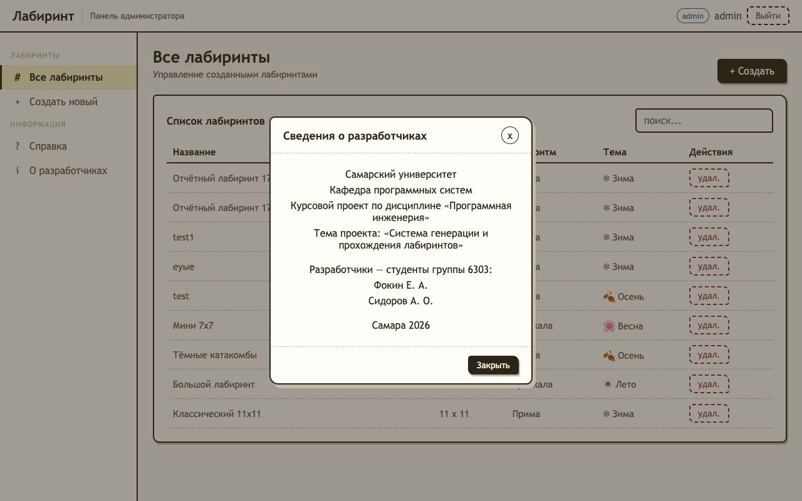

Рисунок N – Модальное окно "Сведения о разработчиках"
