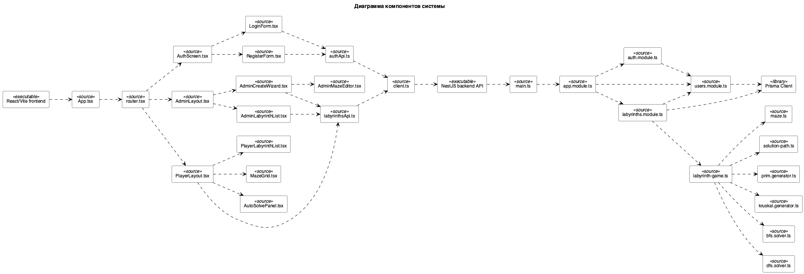

## 3.2.1 Диаграмма компонентов

Диаграмма компонентов описывает особенности физической реализации приложения, определяет архитектуру приложения и устанавливает зависимость между компонентами, в роли которых выступает исполняемый код. Диаграмма компонентов отображает общие зависимости между компонентами. Основными графическими элементами диаграммы являются компоненты, интерфейсы и зависимости между ними [11].

Диаграмма компонентов отображена на рисунке N. Компоненты, входящие в диаграмму представлены в таблице N.

Рисунок N – Диаграмма компонентов системы

Таблица N – Описание компонентов системы

| Название компонента | Назначение компонента | Подсистема |
| --- | --- | --- |
| React/Vite frontend | Исполняемый модуль клиентской части приложения | Клиентская часть |
| App.tsx | Корневой компонент клиентского приложения | Подсистема визуализации |
| router.tsx | Маршрутизация между экранами авторизации, администратора и игрока | Подсистема визуализации |
| AuthScreen.tsx | Экран авторизации пользователя | Подсистема авторизации |
| LoginForm.tsx | Форма входа в систему | Подсистема авторизации |
| RegisterForm.tsx | Форма регистрации пользователя | Подсистема авторизации |
| AdminLayout.tsx | Основной экран администратора | Подсистема администратора |
| AdminLabyrinthList.tsx | Просмотр списка лабиринтов администратором | Подсистема администратора |
| AdminCreateWizard.tsx | Пошаговое создание лабиринта | Подсистема администратора |
| CreateEditorStep.tsx | Шаг редактирования и генерации лабиринта | Подсистема администратора |
| AdminMazeEditor.tsx | Редактирование лабиринта на сетке | Подсистема администратора |
| mazeEditorRules.ts | Правила редактирования, проверки входа, выхода и связности сетки | Подсистема администратора |
| PlayerLayout.tsx | Основной экран игрока | Подсистема игрока |
| PlayerLabyrinthList.tsx | Выбор лабиринта игроком | Подсистема игрока |
| MazeGrid.tsx | Отображение сетки лабиринта | Подсистема визуализации |
| AutoSolvePanel.tsx | Панель автоматического решения лабиринта | Подсистема игрока |
| HelpPage.tsx | Страница справочной информации о системе | Справочная подсистема |
| DevelopersModal | Модальное окно сведений о разработчиках | Справочная подсистема |
| client.ts | Выполнение HTTP-запросов к серверной части | Подсистема взаимодействия с сервером |
| authApi.ts | Запросы авторизации и регистрации | Подсистема взаимодействия с сервером |
| labyrinthsApi.ts | Запросы работы с лабиринтами | Подсистема взаимодействия с сервером |
| @labyrinth/shared types | Общие типы данных клиента и сервера | Общий пакет типов |
| NestJS backend API | Исполняемый модуль серверной части приложения | Серверная часть |
| main.ts | Точка запуска серверной части | Подсистема взаимодействия с клиентом |
| app.module.ts | Корневой модуль серверной части | Подсистема взаимодействия с клиентом |
| auth.module.ts | Модуль аутентификации | Подсистема аутентификации |
| users.module.ts | Модуль работы с пользователями | Подсистема работы с пользователями |
| labyrinths.module.ts | Модуль работы с лабиринтами | Подсистема работы с лабиринтами |
| labyrinths.controller.ts | REST-контроллер операций с лабиринтами | Подсистема взаимодействия с клиентом |
| labyrinths.service.ts | Сервис бизнес-логики лабиринтов | Подсистема работы с лабиринтами |
| labyrinth-game.ts | Доменная модель лабиринта на этапе реализации | Подсистема работы с лабиринтами |
| maze.ts | Доменное представление сетки лабиринта | Подсистема работы с лабиринтами |
| solution-path.ts | Результат поиска пути в лабиринте | Подсистема работы с лабиринтами |
| prim.generator.ts | Генерация лабиринта алгоритмом Прима | Подсистема работы с лабиринтами |
| kruskal.generator.ts | Генерация лабиринта алгоритмом Краскала | Подсистема работы с лабиринтами |
| bfs.solver.ts | Поиск пути алгоритмом BFS | Подсистема работы с лабиринтами |
| right-hand.solver.ts | Поиск пути методом правой руки | Подсистема работы с лабиринтами |
| grid-validation.ts | Проверка размеров, входа, выхода, толстостенности и связности лабиринта | Подсистема работы с лабиринтами |
| Prisma Client | Программный слой доступа backend к PostgreSQL | Подсистема взаимодействия с СУБД |
