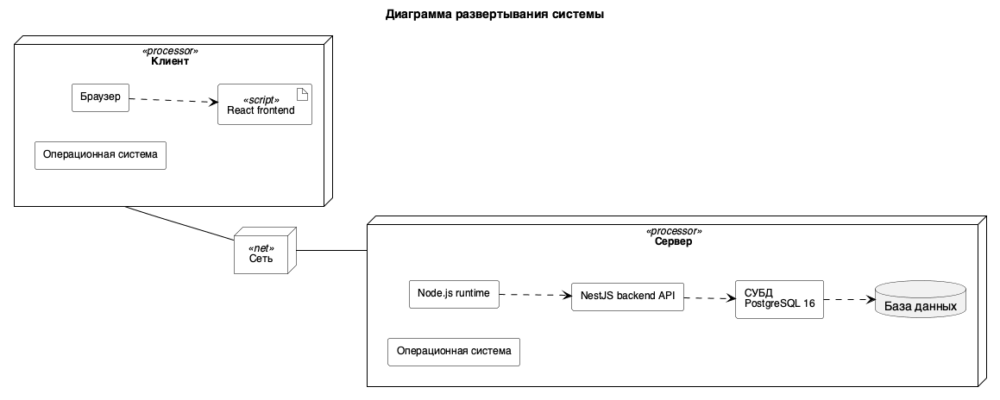

## 3.2.2 Диаграмма развертывания

Диаграмма развертывания описывает физическую реализацию системы, размещение компонентов по узлам ЭВМ и соединения между этими узлами [12].

Диаграмма развертывания системы «Лабиринт» представлена на рисунке N. На ней показаны клиентский компьютер, сервер и сеть между ними.

Рисунок N – Диаграмма развертывания системы

На клиентском узле размещены операционная система, браузер и клиентская часть приложения. На сервере размещены серверная часть приложения, СУБД PostgreSQL 16 и база данных.
