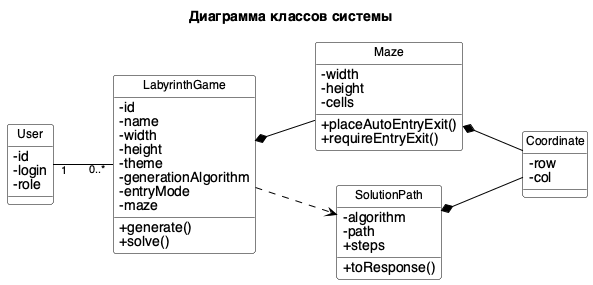

## 3.2.3 Диаграмма классов

В соответствии со спецификацией, приведенной в п. 2.4.6, и с учетом выбранного языка программирования разработана диаграмма классов системы «Лабиринт» на этапе реализации, приведенная на рисунке N.

Рисунок N – Описание классов системы на этапе реализации
