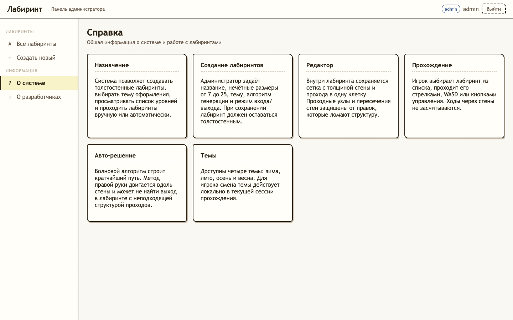

## ПРИЛОЖЕНИЕ А

### Руководство пользователя

#### А.1 Назначение системы

Система «Лабиринт» предназначена для создания, хранения и прохождения двумерных толстостенных лабиринтов. С её помощью администратор сможет создавать лабиринты с заданными параметрами, выбирать алгоритм генерации, расстановку входа и выхода, а также тему оформления, а игрок – проходить созданные лабиринты вручную или с помощью автоматического решения по выбранному алгоритму поиска пути.

#### А.2 Условия работы системы

Для корректной работы клиентской части системы необходимо наличие соответствующих программных и аппаратных средств.

Требования к клиентской части системы:

- тип ЭВМ: x86-64 совместимый или ARM64 совместимый;
- объём ОЗУ – не менее 4 Гб;
- объём свободного дискового пространства – не менее 25 Гб;
- клавиатура или иное устройство ввода;
- мышь или иное манипулирующее устройство;
- монитор с разрешающей способностью не ниже 1280 × 720;
- подключение к сети Интернет;
- операционная система Windows 10 и выше, macOS 12 и выше или Linux Ubuntu 22.04 LTS и выше с графическим окружением GNOME, KDE или эквивалентным;
- браузер Google Chrome 120 и выше, Mozilla Firefox 120 и выше или Apple Safari 17 и выше.

Серверная часть системы располагается на выделенном сервере и предъявляет следующие требования:

- тип ЭВМ: x86-64 совместимый;
- процессор – не менее 2 ядер с тактовой частотой не ниже 2,2 ГГц;
- объём ОЗУ – не менее 2 Гб;
- объём свободного дискового пространства – не менее 20 Гб;
- операционная система Linux Ubuntu Server 22.04 LTS и выше;
- среда выполнения Node.js 22 и выше;
- система управления базами данных PostgreSQL 16 и выше;
- система контейнеризации Docker 24 и выше;
- публичный IP-адрес и подключение к сети Интернет с пропускной способностью не менее 10 Мбит/с.

#### А.3 Доступ к системе

Система поставляется в виде развёрнутого web-приложения, размещённого на сервере. Установка клиентской части на компьютер пользователя не требуется. Для начала работы пользователю необходимо запустить браузер и перейти по адресу, по которому развёрнуто клиентское приложение (например, https://labyrinth.example.com или иной адрес стенда, предоставленный администратором системы). После загрузки страницы пользователю предлагается пройти процедуру авторизации или регистрации.

#### А.4 Работа с системой

##### А.4.1 Вход в систему (авторизация)

На рисунке А.1 приведён экран авторизации. На форме расположены вкладки «Вход» и «Регистрация», поля для ввода логина и пароля, а также кнопка выполнения выбранного действия. На вкладке «Регистрация» дополнительно отображается поле подтверждения пароля. После ввода логина и пароля и нажатия кнопки «Войти» система выполняет аутентификацию пользователя и в зависимости от его роли открывает интерфейс администратора или игрока. При нажатии кнопки «Зарегистрироваться» новый пользователь добавляется в систему с ролью игрока. Роль администратора назначается отдельно администратором системы при необходимости.

Рисунок А.1 – Экран авторизации

##### А.4.2 Работа с системой в режиме администратора

При авторизации пользователя в роли «Администратор» открывается экран управления лабиринтами. В левой части экрана расположено меню администратора, а в основной области отображается список созданных лабиринтов (см. рисунок А.2). Администратор может просматривать лабиринты, выполнять поиск по названию, удалять записи и переходить к созданию нового лабиринта.

Рисунок А.2 – Экран администратора со списком лабиринтов

Создание лабиринта выполнено в виде мастера из трёх шагов. На первом шаге администратор задаёт название лабиринта, ширину, высоту, тему оформления, алгоритм генерации и способ расстановки входа и выхода (см. рисунок А.3).

Рисунок А.3 – Форма создания лабиринта: параметры

Если выбран ручной режим расстановки входа и выхода, на втором шаге отображается поле с рамкой лабиринта и подсвеченными допустимыми позициями на периметре (см. рисунок А.4). На этом этапе доступны только инструменты установки входа и выхода.

Рисунок А.4 – Редактор лабиринта до генерации

После выбора входа и выхода администратор запускает генерацию лабиринта отдельной кнопкой. В сгенерированном лабиринте отображаются стены, проходы, вход и выход (см. рисунок А.5). После генерации становятся доступны инструменты редактирования стен и проходов, а также операции отмены и повтора действия.

Рисунок А.5 – Редактор сгенерированного лабиринта

На третьем шаге отображается форма подтверждения сохранения лабиринта с итоговыми параметрами, выбранной темой, алгоритмом генерации и миниатюрным представлением сетки (см. рисунок А.6). После подтверждения система сохраняет лабиринт в базе данных и возвращает администратора к списку лабиринтов.

Рисунок А.6 – Подтверждение и сохранение лабиринта

Удаление лабиринта выполняется через модальное окно подтверждения (см. рисунок А.7). Такой подход снижает риск случайного удаления записи. Если пользователь подтверждает действие, лабиринт помечается удалённым и исчезает из активного списка.

Рисунок А.7 – Модальное окно удаления лабиринта

Справочная информация о системе доступна на отдельной странице «Справка» (см. рисунок А.8), которая открывается из меню администратора в новой вкладке браузера и описывает назначение приложения, роли пользователей, правила создания лабиринтов и способы прохождения.

Рисунок А.8 – Страница «Справка»

Сведения о разработчиках открываются в отдельном модальном окне поверх текущего экрана (см. рисунок А.9). Открытие модального окна не сбрасывает состояние работы администратора.

Рисунок А.9 – Модальное окно «Сведения о разработчиках»

##### А.4.3 Работа с системой в режиме игрока

При авторизации пользователя в роли «Игрок» открывается экран прохождения лабиринтов (см. рисунок А.10). В левой части отображается список доступных лабиринтов, поиск и выбор темы оформления. Центральная область предназначена для визуализации выбранного лабиринта, а правая панель содержит статистику прохождения, легенду и кнопки управления попыткой. Выбор темы оформления игроком действует локально для текущей сессии и не изменяет тему, заданную при создании лабиринта; при выходе из уровня тема сбрасывается к теме лабиринта.

Рисунок А.10 – Экран игрока со списком лабиринтов

В ручном режиме игрок перемещается по лабиринту с помощью кнопок управления или клавиатуры (см. рисунок А.11). На поле отображается текущая позиция игрока и след прохождения. Управление доступно тремя способами: клавишами стрелок, клавишами W, A, S, D или экранными кнопками управления.

Рисунок А.11 – Ручное прохождение лабиринта

В режиме автоматического решения игрок выбирает алгоритм построения пути – волновой алгоритм или метод правой руки – и режим отображения: мгновенный или с анимацией (см. рисунок А.12). Скорость анимации изменяется во время движения без повторного запуска решения.

Рисунок А.12 – Автоматическое решение лабиринта

После достижения выхода система отображает окно завершения уровня (см. рисунок А.13). В нём показываются количество шагов и время прохождения. После закрытия окна игрок может выбрать другой лабиринт или сбросить текущую попытку.

Рисунок А.13 – Окно завершения уровня

Справочная информация и сведения о разработчиках открываются игроку по тем же пунктам меню, что и администратору: страница справки открывается в новой вкладке браузера, сведения о разработчиках — в модальном окне поверх текущего экрана.
