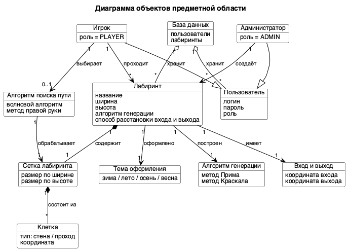
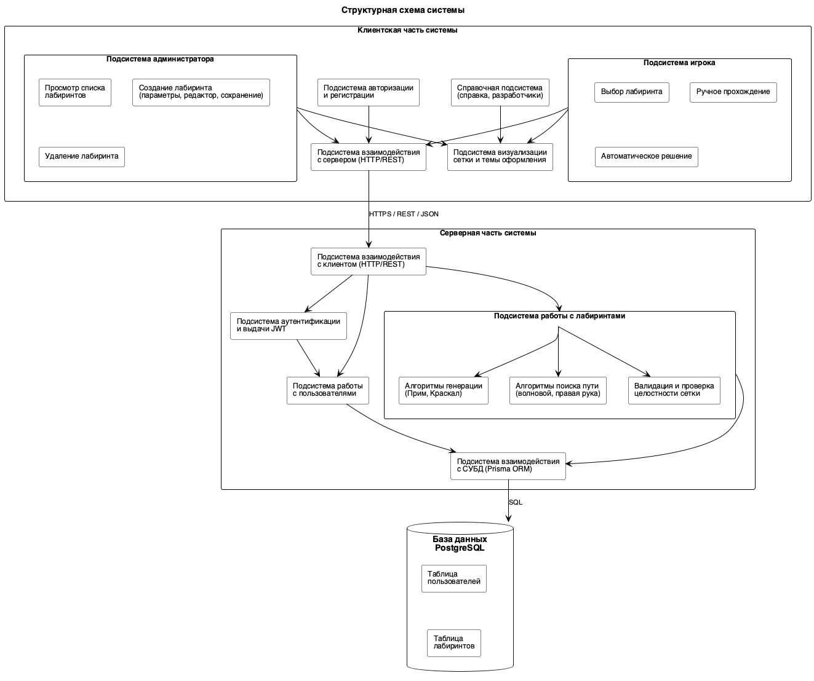
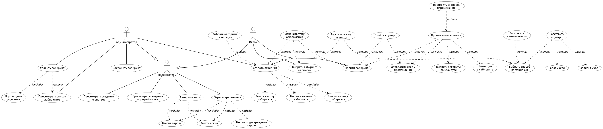

## План презентации

Презентация к защите курсового проекта по системе «Лабиринт». Структура повторяет эталонную презентацию (`refs/gilera.pdf`, 23 слайда), содержимое — из материалов нашего проекта. Слайды-разделители разделов выполнены типографической обложкой: крупный серый текст-фон с дублированием названия раздела цветным основным заголовком.

### Слайд 1. Титульный

- Курсовой проект по дисциплине «Программная инженерия».
- Автоматизированная система **«Лабиринт»**.
- Выполнили: обучающиеся группы [указать номер группы] Сидоров, Фокин.
- Руководитель: [указать ФИО руководителя дисциплины].
- Самарский университет, Самара 2026.

### Слайд 2. Цель и задачи

- **Главная цель:** Разработать автоматизированную систему «Лабиринт» с функциями администратора и игрока.
- **01 Произвести анализ предметной области:**
  - рассмотреть основные понятия предметной области;
  - рассмотреть системы-аналоги;
  - построить диаграмму объектов предметной области.
- **02 Спроектировать систему:**
  - составить спецификацию требований;
  - разработать прототип интерфейса;
  - разработать UML-проект системы.
- **03 Реализовать систему:**
  - разработать систему в соответствии со спецификацией требований;
  - проверить работоспособность системы на наборе тестов.

### Слайд 3. Раздел-разделитель: «Анализ предметной области»

- Слайд-разделитель. Крупный серый текст-фон «АНАЛИЗ ПРЕДМЕТНОЙ ОБЛАСТИ», поверх — цветной основной заголовок «Анализ предметной области».

### Слайд 4. Описание предметной области

- Термин: **Лабиринт** – запутанная система ходов и помещений, разделённых стенами, в которой требуется найти путь от входа к выходу. Слово «лабиринт» имеет древнегреческое происхождение и означает «построение со сложным запутанным планом».
- Иллюстрация — изображение классического лабиринта (можно использовать одно из сгенерированных системой, например `report/images/create-editor-generated.png`, либо стоковую иллюстрацию).

### Слайд 5. Описание предметной области

- Виды лабиринтов:
  - двумерные толстостенные лабиринты (наша система);
  - двумерные тонкостенные лабиринты;
  - объёмные (3D) лабиринты.
- Каждому виду — миниатюрная иллюстрация в карточке с подписью.

### Слайд 6. Описание систем-аналогов

- **«The Maze Generator»** – web-приложение для генерации лабиринтов.
- **Достоинства:** простой и понятный интерфейс; выбор размера лабиринта; экспорт изображения.
- **Недостатки:** отсутствие ручного прохождения; отсутствие автоматического решения; отсутствие выбора алгоритма генерации; отсутствие сохранения; нет тем оформления.
- Скриншот аналога — справа.

### Слайд 7. Описание систем-аналогов

- **«Maze Solver Visualizer»** – web-приложение для визуализации алгоритмов поиска пути.
- **Достоинства:** визуализация работы нескольких алгоритмов поиска пути; настройка скорости анимации.
- **Недостатки:** отсутствие выбора алгоритма генерации лабиринта; отсутствие ручного прохождения; отсутствие сохранения; нет авторизации.
- Скриншот аналога — справа.

### Слайд 8. Описание систем-аналогов

- **«Daedalus»** – десктопное приложение для построения и исследования лабиринтов.
- **Достоинства:** богатый набор алгоритмов генерации; экспорт в различные форматы; режим автоматического решения.
- **Недостатки:** перегруженный интерфейс; требует установки; отсутствие современного web-доступа; отсутствие пользовательских аккаунтов.
- Скриншот аналога — справа.

### Слайд 9. Диаграмма объектов предметной области

- Центральная сущность — Лабиринт; связан с Сеткой, Клетками, Темой оформления, Алгоритмом генерации и Алгоритмом поиска пути; пользователь имеет роль Администратора или Игрока.

### Слайд 10. Раздел-разделитель: «Проектирование системы»

- Слайд-разделитель. Крупный серый текст-фон «ПРОЕКТИРОВАНИЕ СИСТЕМЫ», поверх — цветной основной заголовок «Проектирование системы».

### Слайд 11. Структурная схема системы

- Клиентская часть: подсистемы авторизации, администратора, игрока, визуализации, справки, взаимодействия с сервером.
- Серверная часть: подсистемы взаимодействия с клиентом, аутентификации, работы с пользователями, работы с лабиринтами (генерация / поиск / валидация), взаимодействия с СУБД.

### Слайд 12. Диаграмма вариантов использования

- Три актёра: Пользователь, Администратор, Игрок (Администратор и Игрок наследуются от Пользователя).
- Use-case Пользователя: пройти авторизацию, пройти регистрацию, просмотреть справку, просмотреть сведения о разработчиках.
- Use-case Администратора: создать лабиринт (с подпунктами параметров, генерации, расстановки входа и выхода, редактирования сетки), удалить лабиринт, сменить тему оформления.
- Use-case Игрока: выбрать лабиринт, пройти вручную, запустить автоматическое решение (волновой или метод правой руки), сменить тему оформления.

### Слайд 13. Диаграмма состояний. Администратор

- Подавтомат «Администратор»: ожидание действий → просмотр списка / создание лабиринта (мастер из трёх шагов) / удаление лабиринта / просмотр справки / выход.

### Слайд 14. Диаграмма состояний. Игрок

- Подавтомат «Игрок»: ожидание действий → выбор лабиринта → выбор режима (ручной / автоматический) → прохождение → завершение уровня → возврат к списку.

### Слайд 15. Выбор комплекса программных средств

- Плитка с иконками и подписями:
  - **Операционная система:** Linux Ubuntu 22.04 (сервер), Windows 10 / macOS 12 (клиент).
  - **Язык программирования:** TypeScript 5.9.
  - **Среда выполнения:** Node.js 22.
  - **СУБД:** PostgreSQL 16.
  - **Серверный фреймворк:** NestJS 11.
  - **Клиентская библиотека:** React 19 + Vite 7.

### Слайд 16. Раздел-разделитель: «Реализация системы»

- Слайд-разделитель. Крупный серый текст-фон «РЕАЛИЗАЦИЯ СИСТЕМЫ», поверх — цветной основной заголовок «Реализация системы».

### Слайд 17. Диаграмма классов

- Основные доменные классы серверной части системы: контроллеры, сервисы, репозитории, доменные сущности `User` и `Labyrinth`.

### Слайд 18. Диаграмма развёртывания

- Узлы: клиентский (браузер) — сеть Интернет — серверный (Node.js + PostgreSQL).

### Слайд 19. Физическая модель БД

- Две таблицы: `User`, `Labyrinth`; внешний ключ `createdById`; связь один-ко-многим.

### Слайд 20. Демонстрация работы системы

- Тёмная подложка, поверх — текст крупным шрифтом «Система "Лабиринт"».
- На защите слайд используется как обложка демонстрации работающего приложения (live-демо или видеозапись).

### Слайд 21. Итоги работы

- Рассмотрены основные понятия предметной области и системы-аналоги, построена диаграмма объектов предметной области.
- Составлена спецификация требований, разработаны прототипы интерфейса и UML-проект системы.
- Разработана система в соответствии со спецификацией требований, проверена работоспособность системы на наборе тестов.

### Слайд 22. Спасибо за внимание

- Слайд-обложка. Крупный серый текст-фон «СПАСИБО ЗА ВНИМАНИЕ», поверх — цветной основной текст «Спасибо за внимание».
